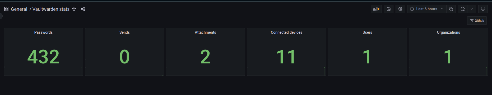

# VWMetrics

Vaultwarden metrics for Prometheus.

## Usage

Build the binary from source or download the arm build from the releases page.

vwmetrics needs the `db.sqlite3` from **your vaultwarden** instance. By default, it needs to be in the **working directory** of vwmetrics. To override this, set the `DB_PATH` env variable. You can also set the `UPDATE_SECS` env var to change the update interval.

The metrics endpoint gets started on `127.0.0.1:3040/metrics`. This cannot be changed.

## Example output

