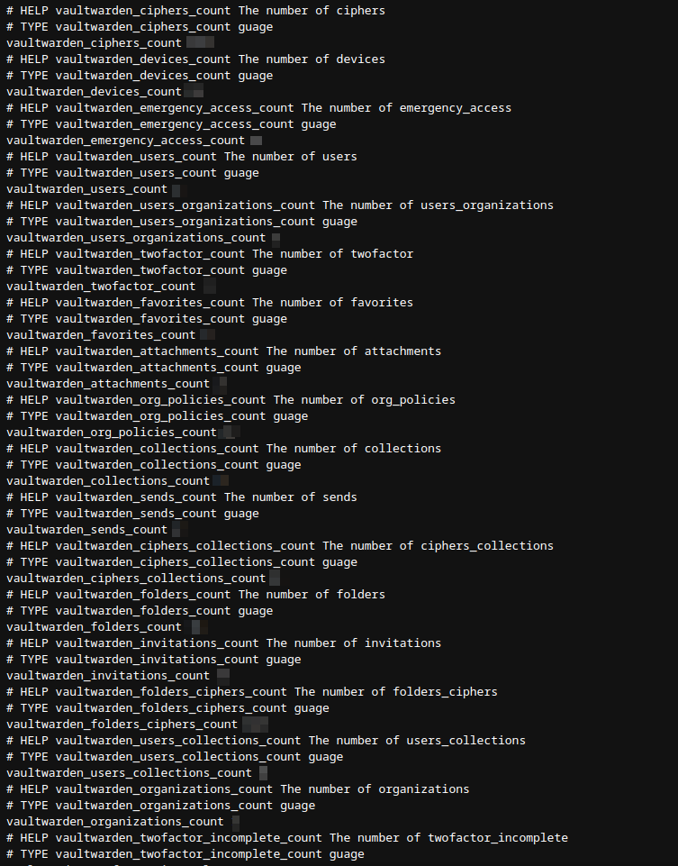

# VWMetrics

Vaultwarden metrics for Prometheus.

## Usage

Build the binary from source or download the arm build from the releases page.

vwmetrics needs the `db.sqlite3` from **your vaultwarden** instance it needs to be in the **working directory** of vwmetrics or you can change the env variable `DB_PATH` to whatever you want you can also change `UPDATE_SECS` to change the update interval.
The metrics endpoint gets started on `127.0.0.1:3040/metrics` (this cannot be changed)

## Example output

